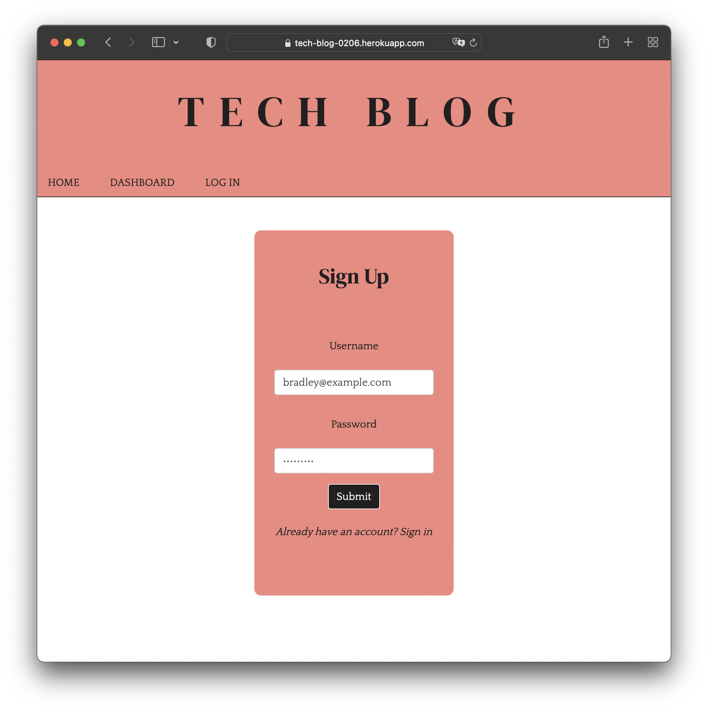
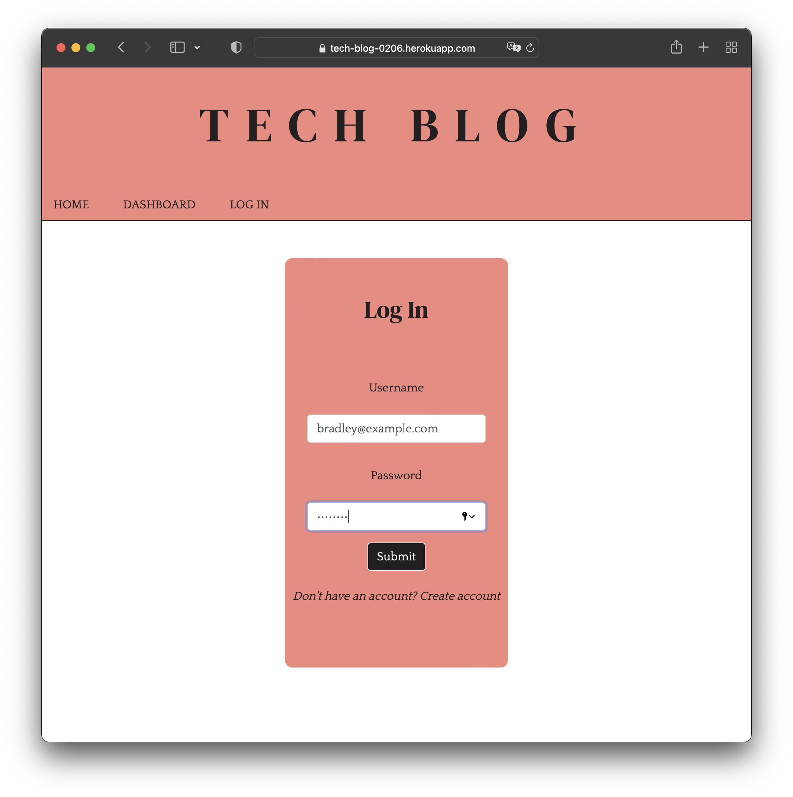
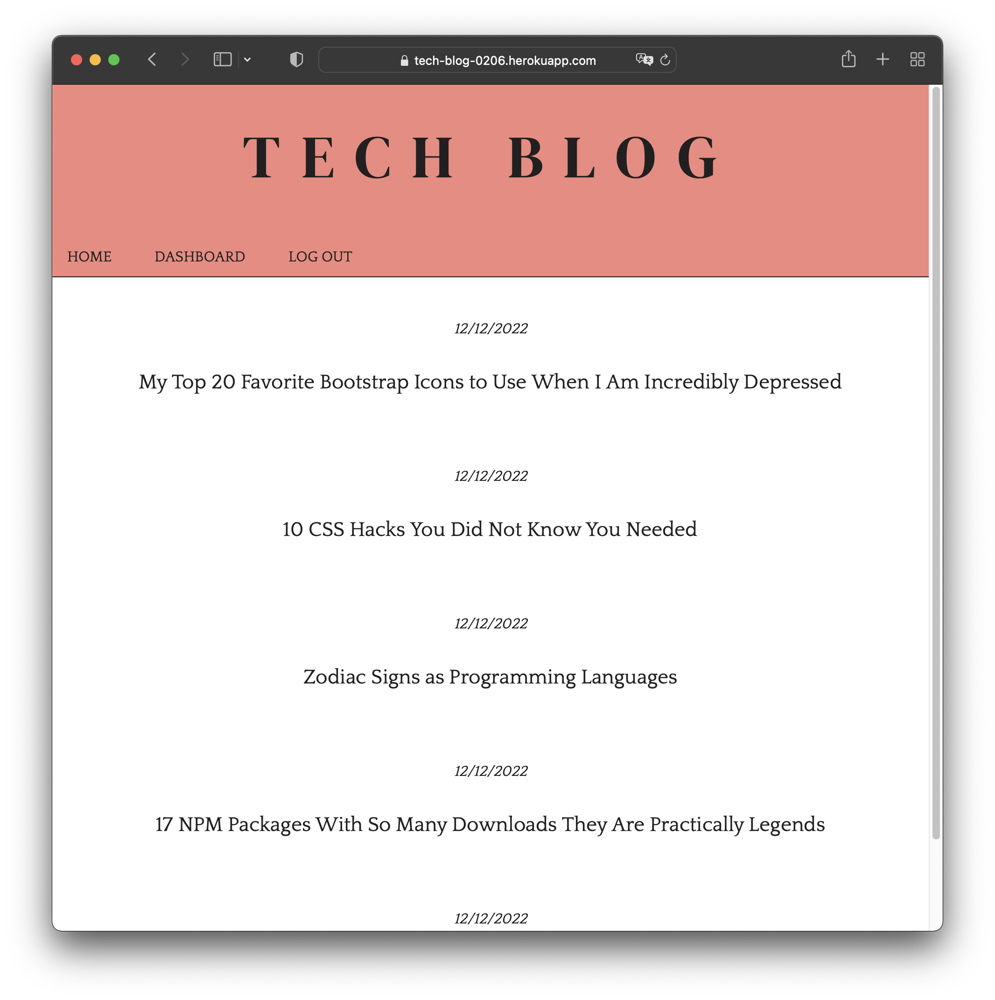
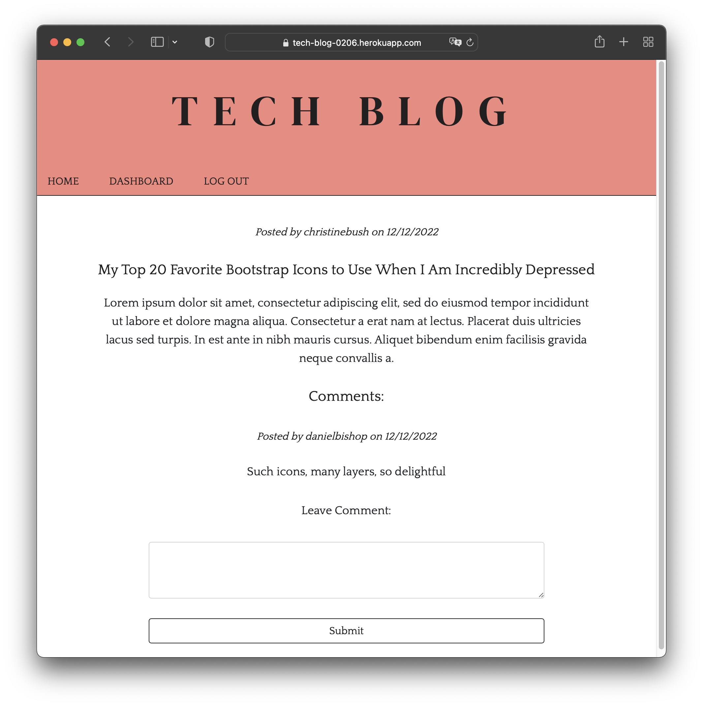
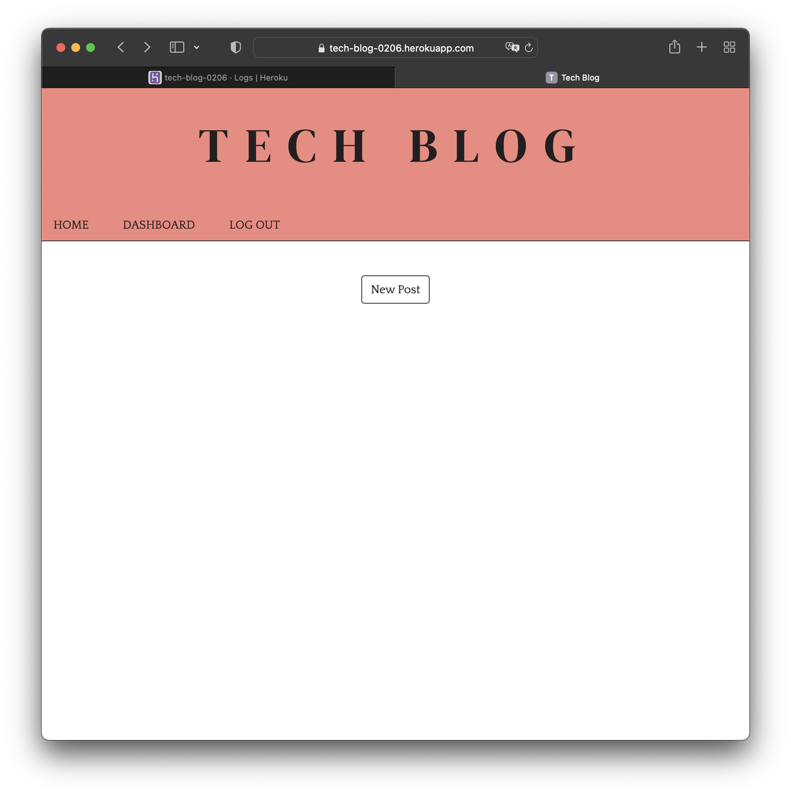
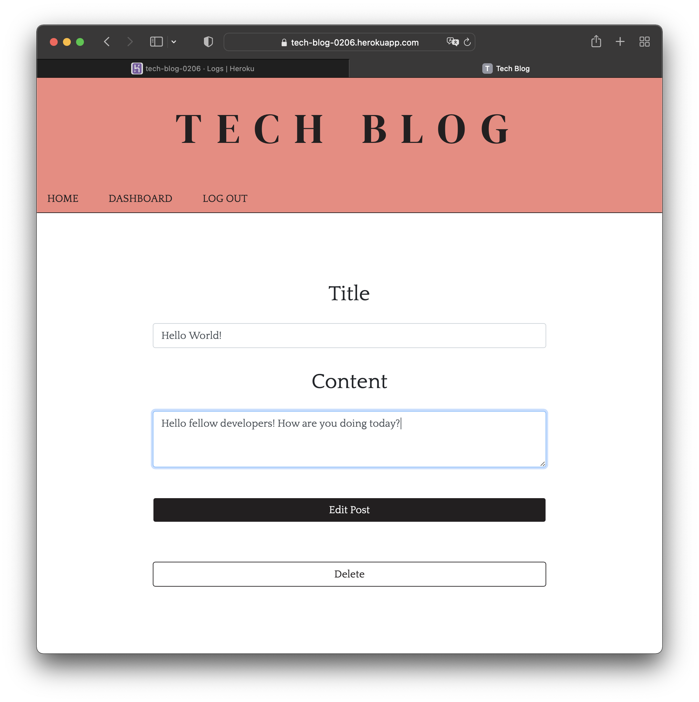

# Tech Blog

 

## License

 

[This application is under the MIT license](https://opensource.org/licenses/MIT)

 

## Deployment Link

 

[Deployment](https://tech-blog-0206.herokuapp.com)

 

☝🏻 Click there!

 

## Table of Contents

 

- [Tech Blog](#tech-blog)
  - [License](#license)
  - [Deployment Link](#deployment-link)
  - [Table of Contents](#table-of-contents)
  - [Description](#description)
  - [Installation](#installation)
  - [Usage](#usage)
  - [Badges](#badges)
  - [Questions](#questions)
    - [GitHub](#github)
    - [Email](#email)

<small><i><a href='http://ecotrust-canada.github.io/markdown-toc/'>Table of contents generated with markdown-toc</a></i></small>

 

## Description

 

Tech Blog is a CMS-style blog site similar to a Wordpress site, where developers can publish their blog posts and (eventually) comment on other developers’ posts as well. Tech Blog follows the MVC paradigm in its architectural structure, using Handlebars.js as the templating language, Sequelize as the ORM, and the express-session npm package for authentication. If you wish to contribute to the future development of Tech Blog, please email me at `jesterb@seattleu.edu `. Any help is welcome, just message me first and I can add you as a collaborator! If you don't know where to start, I've opened 3 issues in the repository that you can check out.

 

## Installation

 

Clone the repository to your local machine, open your terminal, and navigate to the root folder in the **Tech Blog** repository. To install the necessary dependencies, run `npm i` in your command-line terminal.

 

## Usage

 

To begin, create an account with **Tech Blog** by entering a username (an email address is a valid username) and a secure password! Once you've created an account you'll automatically be signed in, however, from time to time you'll be signed out. To sign back in simply follow the example image down below!

 

 

 

Once you're signed in, you'll be presented with the homepage, which includes existing blog posts and navigation links for the homepage, dashboard, and to log out!

 

 

If you click on an existing blog post, you'll be presented with the post's title, contents, creator’s username, and the date it was created! Currently, comment functionality is still being implemented, but you can get a sense for what it will look like with our seed comments!

 

 

If you click on the dashboard option in the navigation, then you'll be taken to your dashboard and presented with blog posts you've created (if you've created any) and the option to add a new blog post. When you click on the button to add a new blog post, then you'll be prompted to enter both a title and contents for your blog post. When you're ready to publish your post simply click on the button to create a new blog post and you'll be taken back to your updated dashboard!

 

 

 

Finally, if you click on one of your existing blog posts in your dashboard then you'll be able to update or delete it!

 

 

## Badges

 

 

 

 

 

 

 

 

 

 

 

 

 

 

 

## Questions

 

If you have any additional questions, you can reach me at:

 

### GitHub

 

 

[jesterb0206](https://www.github.com/jesterb0206)

 

### Email

 

 

jesterb@seattleu.edu

 
